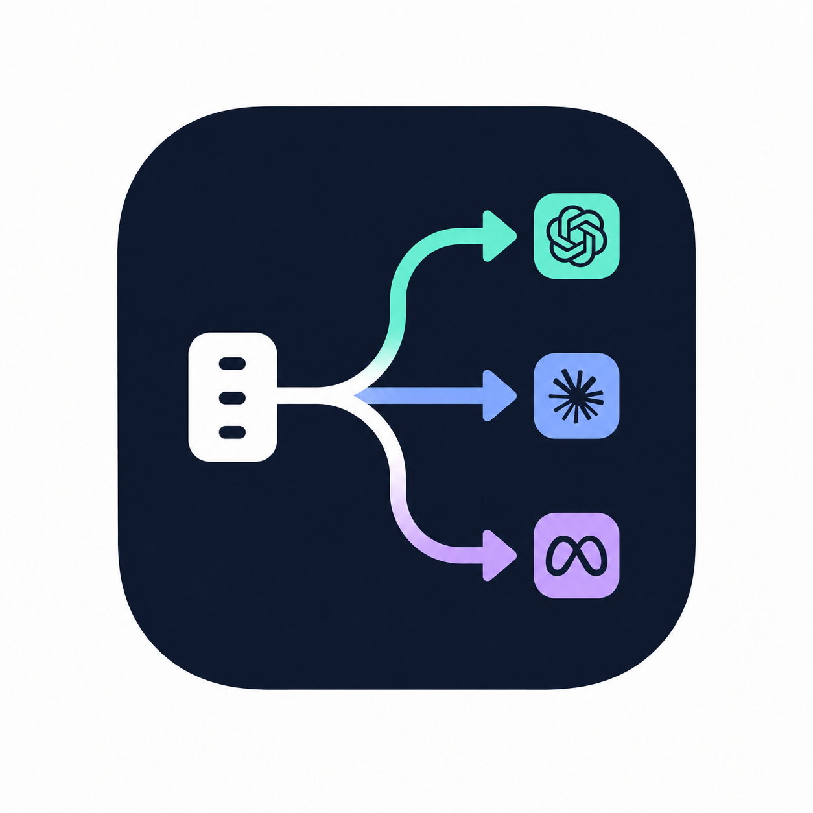

<p align="center">
  
</p>

# model-router

*It reads your prompt, sizes up the job, and hands it to the right model. Then it tells you who got it.*

You know the desk. The one who reads the room in two seconds. Knows which jobs need the expensive
specialist and which just need someone quick and cheap. You drop a prompt; it glances at it, picks
the tier, and routes — Haiku for "what's a closure", Opus for "redesign the auth layer and prove
it's race-free". No LLM call to decide. No ceremony. One line tells you where it went and why.

```
🧭 Router → Opus 4.8  (complex, score 5.5) — multi-step; complex: concurrency, design a, distributed
```

Works with **Claude Code**, **OpenAI Codex CLI**, **Gemini CLI**, **GitHub Copilot CLI**, and any
**OpenAI-compatible API** (including local **Ollama** / **LM Studio**). One scorer, every tool.

## Before / after

```
# before — everything runs on your one default model
what is a closure?                         → frontier model. overkill. you paid for nothing.
redesign the auth layer, prove it's safe   → small model. rushed. you'll redo it.

# after — each prompt goes where it belongs
🧭 Router → Haiku 4.5  (trivial)   what is a closure?
🧭 Router → Opus 4.8   (complex)   redesign the auth layer, prove it's safe
```

## The math

No benchmark charts to wave around — the logic is boring on purpose. Most prompts in a working
session are trivial: definitions, renames, lookups, one-liners. A trivial ask answered by the small
model instead of the frontier one is the **same answer for a fraction of the cost** — and the hard
prompts still get the model that can actually do them. You spend the expensive tokens where they
change the outcome, not on "rename foo to bar".

It decides with regex, not a model: the scorer is pure heuristics, synchronous, sub-millisecond. The
router never burns a token to pick a model.

## How it works

1. A `UserPromptSubmit` hook runs the shared `route.py` on every prompt.
2. `core/scorer.py` scores complexity from transparent signals — length, fenced code, sub-task
   count, multi-step chaining, file references, and complexity/simplicity keywords.
3. The score maps to a tier (`trivial` / `moderate` / `complex`), and `core/providers.json` maps
   that tier to a concrete model for the active provider.
4. The hook makes the assistant **print the router banner as its first line**, then route the work.

### Why it recommends instead of just switching

Here's the honest part. **Claude Code, Codex CLI, and Gemini CLI all share the same
`UserPromptSubmit` hook contract** — identical stdin `{prompt, ...}`, identical
`{"hookSpecificOutput": {"additionalContext": ...}}` output — and **none of them let a hook hot-swap
the live model**. So the model change is always realized one of three ways:

- **Claude Code** delegates non-trivial work to a model-pinned worker subagent
  (`agents/router-*.md`) — that's how the model actually changes.
- **Codex / Gemini** have no model-pinned subagents, so the banner recommends a `/model` switch when
  you're below the tier.
- **Direct API callers** have no hook at all — you call `pick_model(prompt)` and pass the result as
  the `model` parameter.

Already on a model at or above the tier? It just proceeds.

## Install

Pick your tool. Model ids are overridable defaults (`core/providers.json` or
`MODEL_ROUTER_<PROVIDER>_<TIER>` env) — confirm the current ids for your account.

### Claude Code

```
/plugin marketplace add jamesrtubman/model-router
/plugin install model-router@model-router
```

Or for local dev: `claude --plugin-dir /path/to/model-router` (`/reload-plugins` after edits).
Routing is automatic — every prompt gets a banner. Tiers: **Haiku / Sonnet / Opus**.

### OpenAI Codex CLI

```
codex plugin marketplace add jamesrtubman/model-router
codex
```

Then open `/plugins`, install **model-router**, open `/hooks` to review and **trust** its hook, and
start a new thread. (Same install covers the Codex desktop app — restart it after installing.) The
hook auto-detects Codex and maps tiers to **GPT-5 mini / GPT-5 / GPT-5 Pro**.

Prefer a manual install? Merge [`adapters/codex/config.toml`](adapters/codex/config.toml) into
`~/.codex/config.toml`. Full steps: [`adapters/codex/README.md`](adapters/codex/README.md).

### Gemini CLI

The [`adapters/gemini/`](adapters/gemini/) folder *is* a Gemini extension. Link it (set the repo
path in `hooks/hooks.json`, then restart Gemini):

```bash
gemini extensions link ./adapters/gemini      # or: cp -r adapters/gemini ~/.gemini/extensions/model-router
```

Already running Claude-format hooks? `gemini hooks migrate --from-claude` imports them. The shared
hook auto-detects Gemini via `GEMINI_SESSION_ID` — no env needed. Tiers: **Flash-Lite / Flash / Pro**.

### GitHub Copilot CLI

```
copilot plugin marketplace add jamesrtubman/model-router
copilot plugin install model-router@model-router
```

Copilot **ignores per-prompt hook output**, so model-router injects a routing **rubric** at session
start and the assistant self-classifies each prompt against it (announce tier, recommend `/model`).
Tiers: **GPT-5 mini / GPT-5 / GPT-5 Pro**. Needs `python3` on PATH. Details:
[`adapters/copilot/README.md`](adapters/copilot/README.md).

### OpenAI-compatible API (Ollama, LM Studio, …)

No hook surface — pick the model before the request:

```python
from router import pick_model            # adapters/openai-api/router.py
model = pick_model("design a distributed rate limiter and prove it is correct")
client.chat.completions.create(model=model, messages=[...])   # -> "gpt-5-pro"
```

```bash
# point it at any model family — local Ollama, for example
MODEL_ROUTER_OPENAI_TRIVIAL=llama3.2:1b MODEL_ROUTER_OPENAI_COMPLEX=llama3.1:70b \
  python3 adapters/openai-api/router.py "refactor this and prove it correct"
```

Details: [`adapters/openai-api/README.md`](adapters/openai-api/README.md).

## Commands

Inspect how a prompt *would* classify, without doing the work (Claude Code):

```
/model-router:route Refactor the auth service and prove the token refresh is race-free
🧭 Router → Opus 4.8  (complex, score 5.5) — complex: refactor, prove, race condition
```

Per-session knobs (env vars, every tool):

| Var | Effect |
|-----|--------|
| `MODEL_ROUTER_PROVIDER=claude\|openai\|gemini` | pick the model family (default `claude`) |
| `MODEL_ROUTER_<PROVIDER>_<TIER>=<model-id>` | override one tier's model (e.g. `MODEL_ROUTER_OPENAI_COMPLEX=o3`) |
| `MODEL_ROUTER_FORCE=trivial\|moderate\|complex` | force a tier, skip scoring |
| `MODEL_ROUTER_FLOOR=trivial\|moderate\|complex` | never route below this tier |
| `MODEL_ROUTER_OFF=1` | disable routing for the session |

## What scores up, what scores down

**Up:** length, fenced code, 3+ sub-tasks, multi-step chaining (`then`, `after that`), multiple file
references, keywords like *architect, refactor, race condition, concurrency, security, distributed,
migrate, optimize, prove*.

**Down:** very short, plus *what is, define, rename, typo, list all, yes or no*.

| Prompt | Tier |
|--------|------|
| `what is a closure in javascript?` | trivial |
| `rename the variable foo to bar in utils.py` | trivial |
| `add a --verbose flag to cli.py and update the README` | moderate |
| `find why /login returns 500 intermittently and fix it` | moderate |
| `refactor auth to fix a race condition, then design a migration plan and prove it's safe` | complex |
| `architect a multi-tenant billing system: schema, isolation, migration` | complex |

## Development

| What | Where |
|------|-------|
| Signal keywords + score cutoffs | `core/scorer.py` |
| Per-provider tier → model map | `core/providers.json` |
| Add a new provider | new block in `core/providers.json` (+ an adapter if it has a hook) |

```
model-router/
├── route.py                # shared provider-agnostic hook entrypoint
├── core/
│   ├── scorer.py           # complexity heuristics (tier, score, reasons)
│   ├── providers.py        # provider registry loader + env overrides
│   ├── providers.json      # tier → model map per provider
│   ├── emit.py             # banner + additionalContext instruction
│   └── rubric.py           # session-start routing rubric (Copilot)
├── adapters/
│   ├── codex/              # Codex CLI: config.toml hook (provider=openai)
│   ├── gemini/             # Gemini CLI extension (provider=gemini)
│   ├── copilot/            # Copilot CLI: sessionStart rubric injector
│   └── openai-api/         # router.py: pick_model() + CLI for direct API calls
├── .claude-plugin/         # plugin.json + marketplace.json (Claude Code + `/plugin marketplace add`)
├── .codex-plugin/          # plugin.json (Codex `plugin marketplace add`) — shares hooks/hooks.json
├── .github/plugin/         # plugin.json + marketplace.json (Copilot `plugin marketplace add`)
├── hooks/                  # hooks.json (Claude+Codex+Gemini) + copilot-hooks.json
├── agents/                 # model-pinned subagents (Claude delegation targets)
└── skills/route/SKILL.md   # /model-router:route — inspect a classification
```

## FAQ

**Can a hook switch the model mid-session?** No — not on any of these tools. That's the whole reason
routing is a recommendation (and, on Claude Code, a subagent delegation).

**Does scoring call an LLM?** No. Pure regex heuristics, synchronous, sub-millisecond. It never
spends a token to decide.

**What if it guesses wrong?** It tells you to say so in one line and route by your own judgment. Or
pin it: `MODEL_ROUTER_FORCE=complex`, `MODEL_ROUTER_FLOOR=moderate`.

**Is this Claude-only?** No. Claude Code, Codex CLI, Gemini CLI, GitHub Copilot CLI, and any
OpenAI-compatible endpoint.

**Why is Copilot different?** Copilot CLI ignores `userPromptSubmitted` hook output and only reads
`additionalContext` at `sessionStart`. So instead of a per-prompt banner, it gets a standing routing
rubric at session start and self-classifies each prompt. If Copilot later surfaces prompt-hook
output, the shared scorer routes it per-prompt like the rest.

**Are the GPT / Gemini model ids real?** They're sensible defaults — confirm the current ids for your
account and edit `core/providers.json` or set the env overrides.

## License

MIT.
